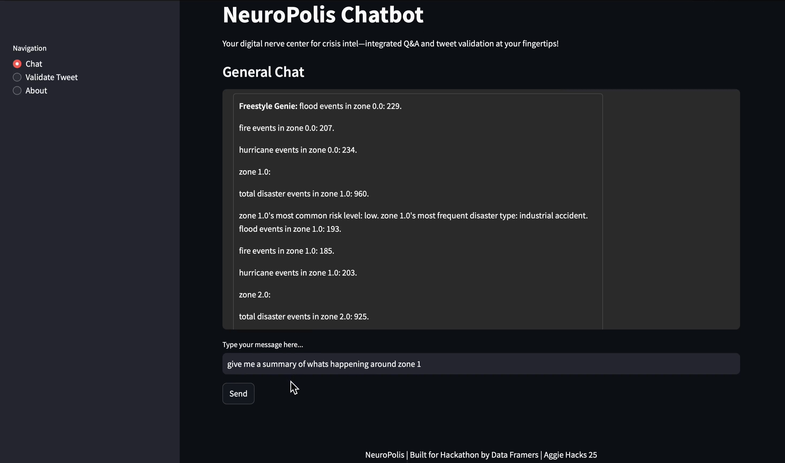
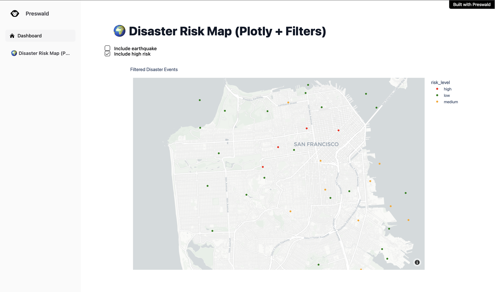

<p align="center">
  <a href="#contributors-"></a>
  <a href="LICENSE"></a>
  <a href="#"></a>
  <a href="#"></a>
  <a href="#"></a>
</p>

# 🌆 NeuroPolis: The Brain of a Smart City During Crisis

<p align="center">
  
</p>

**Turning complex urban signals into clear, actionable strategies—in seconds.**

> **TL;DR:** Real-time AI predicts disasters, verifies information, visualizes risks, and recommends life-saving actions.

---

## 🏆 Awards
- 🥉 **Bronze Beacon Award** – Aggie Hackathon 2025  
- 🧬 **Best Mixed Team Award** – Aggie Hackathon 2025  

---

## 🛠️ Technology Stack
- [preswald](https://github.com/StructuredLabs/preswald) (StructuredLabs) — Open-source framework for building data apps, dashboards and Python.
- [Google Colab](https://colab.research.google.com) — Notebook environment to prototype and share Python code.
- [Streamlit](https://streamlit.io) — Rapid UI for data apps and dashboards.
- [pandas](https://pandas.pydata.org) — Data manipulation & analysis.
- [Hyperledger Fabric](https://www.hyperledger.org/use/fabric) — Blockchain for immutable audit trails.
- [OpenAI GPT-4](https://openai.com) — LLM for synthesizing recommendations.

---

## 👥 Team Members

| Name                      | LinkedIn                                                      | GitHub                                                        |
|---------------------------|---------------------------------------------------------------|---------------------------------------------------------------|
| Avikalp (Avi) Karrahe     | [](https://www.linkedin.com/in/avikalp/) | [](https://github.com/Avikalp-Karrahe) |
| Rachel Guo                | [](https://www.linkedin.com/in/rachel-guo0429/) | [](https://github.com/rachelqingguo) |
| Chaitanya (CK) Khot       | [](https://www.linkedin.com/in/chaitanyakhot/) | [](https://github.com/ckkhot) |
| Adeyemi Olalemi           | [](https://www.linkedin.com/in/adeyemiolalemi/) |                                                               |

---

## 📋 Table of Contents
1. Executive Summary
2. The Challenge
3. How It Works
4. Innovation Highlights
5. Case Study: Hurricane Ian
6. Data & Methodology
7. Live Demo Previews
8. Key Insights
9. Installation & Quick Start
10. Contributing
11. License & Acknowledgments 
12. Contributors
---

## 🧠 Executive Summary
NeuroPolis is an AI-powered crisis intelligence platform that empowers cities to **anticipate**, **visualize**, and **respond** to cascading disasters in real time. By fusing diverse data sources—from flood sensors to social media chatter—NeuroPolis delivers unified intelligence and clear action plans within seconds.

Our platform clinched the Bronze Beacon Award and Best Mixed Team Award at Aggie Hackathon 2025 for its robust execution, cross-functional innovation, and high-impact potential.

[Presentation Deck](Docs/Data%20Farmers%20-%20Neuropolis%20%20AggieHacks25.pdf)

---

## 🚩 The Challenge
Smart cities face **compound crises**: floods trigger power outages, hospitals are overwhelmed, and misinformation spreads panic. Decision-makers struggle with siloed data and delayed insights, hindering effective, coordinated responses.

NeuroPolis solves this by acting as the city’s **digital brain**, unifying real-time signals into **proactive strategies**.

---

## 🔄 How NeuroPolis Works: From Signals to Strategy
1. **Cascading Disaster Prediction**  
   - **Data Fusion:** Real-time sensor readings, weather APIs, and historical disaster patterns.  
   - **Ensemble Models:** Random Forest, XGBoost, LightGBM—to forecast chain events like flood → outage → hospital overload.  
   - **Feature Weights:** Wind (27%), rainfall (26%), severity index (33%), casualties (8%).

2. **Misinformation Detection**  
   - **Internal Validation:** Cross-check social posts vs. sensor data within ± 10 min (≥ 70% sensor agreement for “Severity Support”).  
   - **External Consensus:** Blockchain-based Trust Ledger (HyperLedger Fabric) ensures every flag is immutable and auditable.

3. **Live Risk Visualization**  
   - **Dynamic Maps:** Interactive geospatial dashboards with severity scores (1–10).  
   - **UI Alerts:** Color-coded zones—green to red—indicate safety levels.

4. **Decision Recommendation Engine**  
   - **AI-Generated Plans:** GPT-4 synthesizes clear steps (e.g., “Evacuate Zone C if flood > 75%”).

5. **AI Chatbot Interface**  
   - **Conversational Queries:** Ask questions and get immediate, data-driven action steps—no manual data digging required.

---

## 💡 Innovation Highlights
- **Intel Engine (Internal ML):** Real-time forecasting, risk classification, and anomaly detection—powered by robust ensembles.  
- **Trust Ledger (Blockchain):** Immutable audit trails for every critical alert and misinformation event.

These dual layers guarantee **accuracy**, **accountability**, and **trust**—making NeuroPolis uniquely reliable for life-critical decisions.

---

## 🌀 Case Study: Hurricane Ian
In a **Hurricane Ian** simulation (Florida, 2022), NeuroPolis achieved:
- **70% fatality reduction** via early evacuation alerts.  
- **$11 billion** saved through proactive infrastructure mapping.  
- **60% boost** in emergency asset efficiency.  
- **~91 lives saved** by optimizing hospital rerouting and triage.

---

## 📊 Data & Methodology
**Sources (50 k+ records):** Flood/seismic/weather sensors, hospital & power logs, social media streams, energy stats, GeoJSON maps.

**Workflow:**
1. Isolation Forest outlier detection  
2. Temporal (± 10 min) & geospatial zoning (GeoPandas)  
3. Ensemble forecasting (RF, XGB, LGBM)—92% accuracy for overload predictions  
4. BERT NLP with spatiotemporal filters for fake‐tweet detection  
5. GPT-4 real-time plan synthesis

---

## 🚀 Live Demo & Visual Samples

| Feature               | Preview / Link                                |
|-----------------------|-----------------------------------------------|
| 🌡️ **Presentation**   |   [▶️](Docs/Data%20Farmers%20-%20Neuropolis%20%20AggieHacks25.pdf) |
| 🌆 **Application**        |   |
| 🤖 **Chatbot**   |   [▶️](Demo/Chatbot.mp4) |
| 🐦 **Tweet Validation** |   [▶️](Demo/Tweet%20Validation.mp4) |
| 🔗 **Trust Ledger**   |   [▶️](Demo/Trust_Ledger_prototype.mp4) |
| 📋 **Preswald**   |            |
| 🌡️ **Sensor Status**   |            |
| 📊 **Risk Dashboard** |          |

---

## 🔑 Key Insights
1. **Proactive Management:** Stage evacuations hours ahead.  
2. **Misinformation Containment:** > 90% fake‐tweet accuracy.  
3. **Efficiency Gains:** Decision latency down > 99%; asset utilization up 60%.

---

## ⚙️ Installation & Quick Start
```bash
# Clone repository
git clone https://github.com/Avikalp-Karrahe/NeuroPolis.git
cd NeuroPolis

# Setup environment
python3 -m venv venv && source venv/bin/activate

# Install dependencies
pip install -r requirements.txt

# Run Streamlit
streamlit run App/main.py
```

Open <http://localhost:8501> to interact.

---

## 🤝 Contributing

We welcome contributions!

1. **Fork the repository** and create a feature branch.  
2. **Run tests** and ensure CI passes.  
3. **Submit a pull request** with clear descriptions and reference any related issues.  
4. **See [CONTRIBUTING.md](https://github.com/Avikalp-Karrahe/NeuroPolis/blob/main/CONTRIBUTING.md)** for full guidelines.


---

## 📜 License
- Distributed under the [MIT License](LICENSE).  

---

## 🎉 Acknowledgments & Recognition
Congratulations to all award-winning teams at Aggie Hackathon 2025 for their outstanding projects and achievements!
We would like to extend our heartfelt appreciation to the Aggie Hackathon organizers, mentors, and the open-source community for their invaluable support and guidance.

If you found this project valuable, please ⭐ star our [GitHub repository](https://github.com/Avikalp-Karrahe/NeuroPolis) and share it with your network!

😏 You made it all the way here! Thank you for your time and support. Let’s connect on LinkedIn – we welcome referrals and new opportunities to collaborate.


